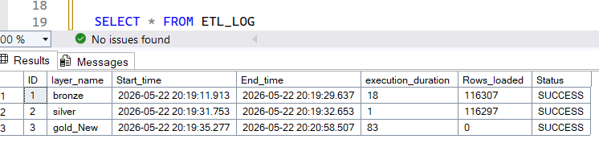

# 🚀 End-to-End Data Warehouse & ETL Pipeline

## 📌 Project Overview

This project demonstrates the design and implementation of a complete Enterprise Data Warehouse Solution using a Medallion Architecture (Bronze → Silver → Gold).

The pipeline integrates CRM and ERP data sources, performs data cleaning and transformation, applies data quality validations, and delivers analytical-ready star schema models for reporting and business intelligence.

The entire workflow is orchestrated using Apache Airflow with automated ETL monitoring and logging.

---

# 🏗️ Architecture

## Medallion Architecture

### 🥉 Bronze Layer
Raw ingestion layer that stores source data without transformations.

### 🥈 Silver Layer
Data cleansing, standardization, deduplication, and business transformations.

### 🥇 Gold Layer
Business-ready dimensional model using Star Schema for analytics and reporting.

---

# 📊 Data Flow

```text
CRM / ERP CSV Files
        ↓
    Bronze Layer
        ↓
    Silver Layer
        ↓
     Gold Layer
        ↓
 Power BI Reporting
```

---

# ⚙️ Technologies Used

| Technology | Purpose |
|---|---|
| SQL Server | Data Warehouse |
| Apache Airflow | Workflow Orchestration |
| SQL | ETL & Data Modeling |
| GitHub | Version Control |

---

# 🧱 Data Warehouse Design

## Fact Table
- Fact_Sales

## Dimension Tables
- Dim_Customers
- Dim_Products
- Dim_Date

---

# 🔄 ETL Pipeline

## Bronze Layer
- Full-load ingestion using BULK INSERT
- Raw data storage
- Source-level preservation

## Silver Layer

Full-load ingestion using INSERT
Data transformations include:

- Data cleansing
- Null handling
- Standardization
- Deduplication
- Data type corrections
- Business rule transformations

## Gold Layer

- Star schema implementation
- Initial loading
- Incremental loading
- SCD Type 2 implementation for product tracking
- Analytical modeling

---

# 🔁 Incremental Loading

Implemented incremental loading strategy for:

- Fact_Sales
- Dim_Customers
- Dim_Products

The solution includes:

- Change detection
- SCD Type 2 handling
- Historical tracking
- Duplicate prevention

---

# 🧪 Data Quality Framework

Automated data quality checks were implemented using Airflow and SQL validations.

## Implemented Checks

- Null validation
- Duplicate detection
- Business rules validation
- Referential integrity checks
- Row count validation

---

# 📈 ETL Monitoring & Logging

The pipeline includes ETL observability features through logging tables.

## Logged Information

- Start Time
- End Time
- Execution Duration
- Rows Loaded
- Pipeline Status

---

# 🛠️ Performance Optimization

Implemented performance tuning techniques including:

- Nonclustered indexing
- Incremental load optimization
- SCD2 indexing strategy
- Fact table lookup optimization

---

# 🔄 Apache Airflow Orchestration

Airflow DAGs automate:

- Bronze loading
- Silver transformations
- Gold incremental loading
- Data quality checks

## Features

- Task dependencies
- Retry handling
- Daily scheduling
- Automated orchestration

---


# 📸 Screenshots

## Screenshots

### Data Flow


### Data Model (Star Schema)
.png)

### ETL Pipeline Tasks


### Data Quality Tasks


### ETL Log Table



### Data Quality LOG Table


## Recommended Screenshots

- Airflow DAGs
- ETL Logs
- Data Quality Results
- Star Schema Diagram
- Power BI Dashboard

---

# 🚀 Future Enhancements

- Cloud migration (Azure / Fabric / Snowflake)
- Real-time streaming ingestion
- Automated alerting system
- CI/CD pipeline integration
- dbt integration

---

# 📚 Key Concepts Demonstrated

- Data Warehousing
- Medallion Architecture
- ETL Development
- Incremental Loading
- SCD Type 2
- Star Schema Modeling
- Data Quality Engineering
- Workflow Orchestration
- Performance Tuning

---

## 👤 About Me

I’m a Data Analyst working in the hatchery industry, with strong experience in SQL, Power BI, Excel, and Python.  
I focus on building data-driven solutions, improving reporting systems, and developing end-to-end data warehouse pipelines.  
I’m also expanding into AI agents and data engineering to automate insights and support smarter business decisions.
